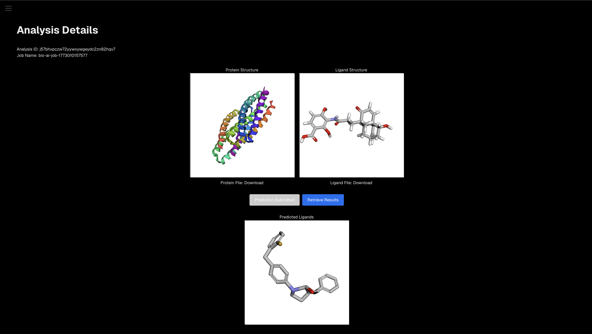

# Drug Discovery Web Application

This repository contains the source code for a web application developed for the YC Bio x AI Hackathon on March 8th, 2026. The application provides a platform for computational drug discovery, allowing users to analyze protein-ligand interactions, predict novel ligand candidates, and review detailed ADMET (Absorption, Distribution, Metabolism, Excretion, and Toxicity) prediction scores.

## Key Features

-   **Protein & Ligand Upload:** Users can upload protein (PDB) and ligand (SDF) files to initiate an analysis.
-   **3D Visualization:** Interactive 3D visualization of protein and ligand structures using 3Dmol.js.
-   **Alternate Ligand Prediction:** Integration with the Tamarind.bio API to submit jobs and predict alternative ligands for a given protein target.
-   **Result Retrieval & Display:** Fetch and display prediction results, including novel ligand structures.
-   **Sample Report Page:** A comprehensive demo page (`/demo`) showcasing the application's analysis and visualization capabilities with sample data.
-   **ADMET Score Analysis:** Download detailed CSV reports of ADMET prediction scores for generated ligands.

## Tech Stack

This project leverages a modern, full-stack serverless architecture:

-   **Backend & Database:** [**Convex**](https://www.convex.dev/) is used for the backend logic, real-time database, and file storage. All API interactions and data mutations are handled through Convex functions.
-   **Computation & Biological Models:** [**Tamarind.bio**](https://www.tamarind.bio/) provides the core computational power for predicting alternate ligands and running complex biological simulations.
-   **Frontend Framework:** [**Next.js**](https://nextjs.org/) (with the App Router) and [**React**](https://react.dev/) are used to build the user interface.
-   **3D Molecular Visualization:** [**3Dmol.js**](https://3dmol.csb.pitt.edu/) is used for rendering interactive 3D structures of proteins and ligands directly in the browser.

## Sample UI




Refer this URL for the sample demo : [https://bioaihack.eshan.dev/demo](https://bioaihack.eshan.dev/demo)


## Getting Started

1.  **Clone the repository:**
    ```bash
    git clone <repository-url>
    ```
2.  **Install dependencies:**
    ```bash
    npm install
    ```
3.  **Set up Convex:**
    -   Follow the Convex documentation to initialize the project and deploy the backend functions.
    -   Add the required Tamarind.bio API key and email to your Convex project's environment variables.
4.  **Run the development server:**
    ```bash
    npm run dev
    ```
5.  Open [http://localhost:3000](http://localhost:3000) with your browser to see the result.
